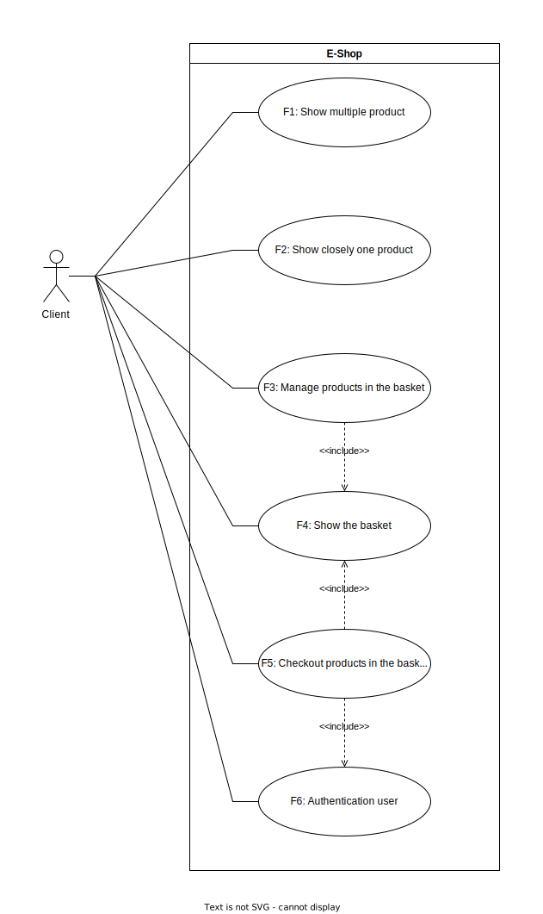
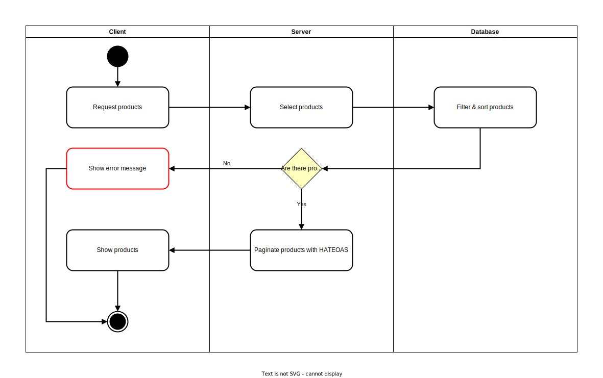
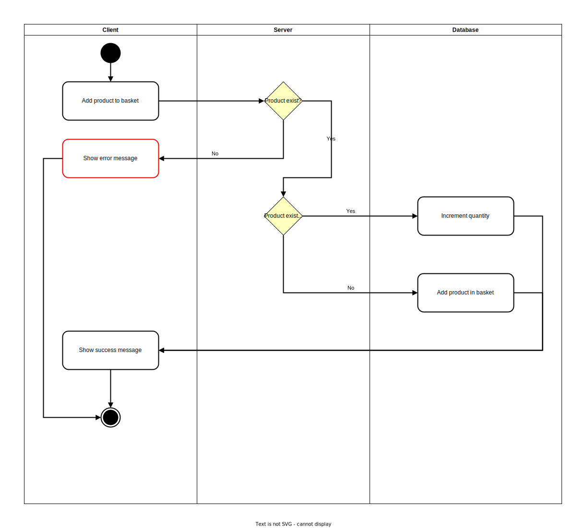
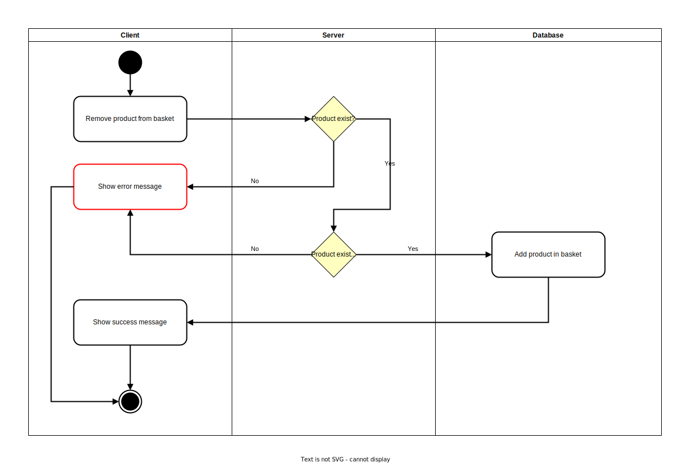
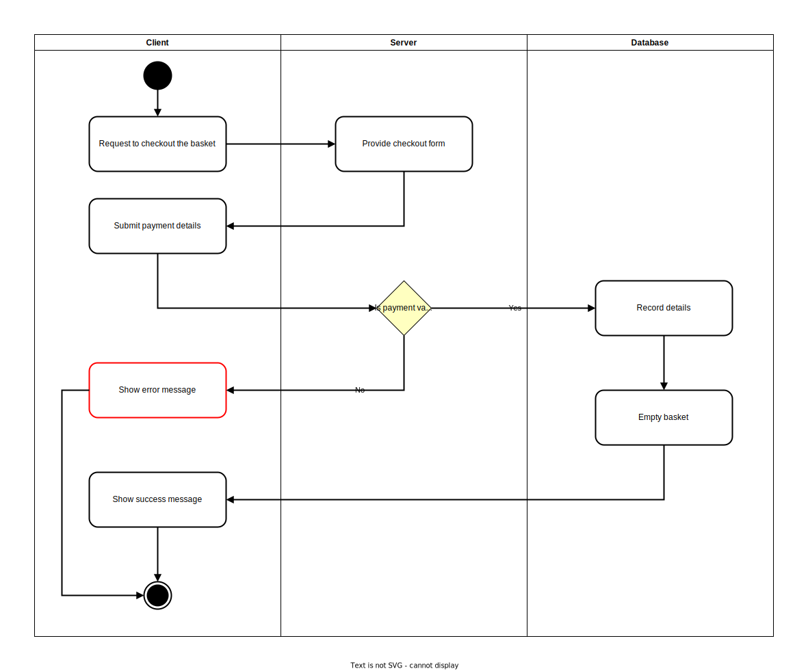

# E-shop
<!-- ❌ Don't Delete This Comment ❌
Project Name:
  eshop-nestjs
Project short description:
  Backend RESTful API of an online store application with Docker, Nest.js, TypeORM and MySQL
Project Topics (tags):
  mysql api docker typeorm typescipt nestjs-backend
-->

This project is a backend RESTful API of an online store application.

## Table content

* Table content
* [Description](#description)
  * [Features](#features)
  * [Versions](#versions)
  * [Technology Stack](#technology-stack)
* [UML diagrams](#uml-diagrams)
  * [Use case diagrams](#use-case-diagrams)
  * [Activity diagrams](#activity-diagrams)
  * [Classes diagrams](#classes-diagrams)
* [Database](#database)
* [API: Overall info](#api-overall-info)
* [API: Reference](#api-reference)
  * [`basket`](#basket)
  * [`card`](#card)
  * [`criteria`](#criteria)
  * [`limit`](#limit)
  * [`picture`](#picture)
  * [`product`](#product)
  * [`products`](#products)
  * [`page`](#page)
  * [`price`](#price)
  * [`sort`](#sort)
  * [`user`](#user)
* [API: Endpoints](#api-endpoints)
  * [Create an user](#create-an-user)
  * [Log in an user](#log-in-an-user)
  * [Delete an user](#delete-an-user)
  * [Get Multiple Products](#get-multiple-products)
  * [Get One Product](#get-one-product)
  * [Get Basket](#get-basket)
  * [Add Products To The Basket](#add-products-to-the-basket)
  * [Change Products In The Basket](#change-products-in-the-basket)
  * [Remove Products From The Basket](#remove-products-from-the-basket)
  * [Checkout The Basket](#checkout-the-basket)
* [API: Error Handling](#api-error-handling)
  * [Error: Structure](#error-structure)
  * [Error: Category](#error-category)
  * [Error: Documentation](#error-documentation)

## Description

### Features

| ID  | Description                              |
| --- | ---------------------------------------- |
| F1  | Show multiple product                    |
| F2  | Show closely one product                 |
| F3  | Add and remove a product from the basket |
| F4  | Show the basket                          |
| F5  | Checkout products in the basket          |
| F6  | Authentication user                      |

### Versions

| Version | Feature to implement |
| :-----: | :------------------: |
|  v1.0   |       F1 to F6       |

### Technology Stack

| Back-end   |
| ---------- |
| Nest.js    |
| TypeScript |
| TypeORM    |
| MySQL      |
| Docker     |

<!-- ## Client-Server Architecture

[](./docs/rsc/network-components.drawio.svg) -->

## UML diagrams

### Use case diagrams

[](./docs/rsc/use-case.drawio.svg)

### Activity diagrams

* Feature F1:
[](./docs/rsc/activity-f1.drawio.svg)
* Feature F2:
[](./docs/rsc/activity-f2.drawio.svg)
* Feature F3-Add:
[](./docs/rsc/activity-f3-add.drawio.svg)
* Feature F3-Remove:
[](./docs/rsc/activity-f3-remove.drawio.svg)
* Feature F5:
[](./docs/rsc/activity-f5.drawio.svg)

### Classes diagrams

[](./docs/rsc/class-diagram.drawio.svg)

## Database

* **Database Foreign Key Actions:**
  | Table          | Foreign Key | On Delete | On Update |
  | -------------- | ----------- | --------- | --------- |
  | Card           | user_id     | `CASCADE` | `CASCADE` |
  | Basket         | user_id     | `CASCADE` | `CASCADE` |
  | Basket         | product_id  | `CASCADE` | `CASCADE` |
  | ProductPicture | product_id  | `CASCADE` | `CASCADE` |

* **ER Diagram**:
  * *I used `one-to-one` links for clarity*

  [](./docs/rsc/erd-database.drawio.svg)

## API: Overall info

* **Paradigm:** `REST API`
* **Data structures and types:** `JSON`
* **Authentication:** `JWT`
* **Authorization:** Each user has access to their own data only

## API: Reference

### `basket`

* `basket`:
  * Description: Basket where users put their [`product`](#product)
  * type: `object`
  * properties:
  * [`products`](#products)
  * `subtotal`:
    * Description: The total price of the basket
    * type: `float`
    * required: `True`

### `card`

* `card`:
  * Description: Payment card details
  * type: `object`
  * Properties:
    * `firstname`:
      * Description: Card's firstname
      * type: `string`
      * required: `True`
    * `lastname`:
      * Description: Card's lastname
      * type: `string`
      * required: `True`
    * `digit`:
      * Description: Card's number
        * Constrains:
          * Can be managed as a string because do not need the numeric value
      * type: `string`
      * required: `True`

### `criteria`

* `criteria`:
  * Description: Value on which to base the sorting [`sort`](#sort)
  * type: `enum`
  * value: **See the usage**

### `limit`

* `limit`:
  * Description: The maximum number of requested resources returned
  * type: `int`

### `picture`

* `picture`:
  * Description: Link (URL or path) to access picture
  * type: `string`

### `product`

* `product`:
  * Description: A product
  * type: `object`
  * properties:
    * `id`:
      * Description: Product's identifier
      * type: `string`
    * `name`:
      * Description: Product's name
      * type: `string`
    * `pictures`:
      * Description: List of product [`picture`](#picture)
      * type: `list`
    * `quantity`:
      * Description: Quantity of the product
      * type: `int`
      * required: `False`
    * [`price`](#price):
      * Description: Product's price
      * required: `True`

### `products`

* `products`:
  * Description: List of [`product`](#product)
  * type: `list`

### `page`

* `page`:
  * Description: Indicate the position of the page to get in pagination
  * Constraint:
    * The position of the first page is `0`
    * If not given then the default page position if `0`
    * If the page position is outside the number of page available then the last page is returned
  * type: `int`

### `price`

* `price`:
  * Description: A price
  * type: `object`
  * Properties:
    * `value`: Price's value
      * type: `float`
    * `symbol`: Price's currency symbol
      * type: `string`

### `sort`

* `sort`:
  * Description: To order the response
  * type: `enum`
  * value: `asc`|`desc`

### `user`

* `user`:
  * Description: An user
  * type: `object`
  * properties:
    * `id`:
      * Description: user's identifier
      * type: `string`
      * required: `False`
    * `email`:
      * Description: user's email
      * type: `string`
    * `password`:
      * Description: user's password
      * type: `string`

### API: Endpoints

#### Create an user

* **Description**: Create a new user
* **Request**:
  * Path: `/api/v1/user`
  * Method: `POST`
  * Parameter:
    * [`email`](#user):
      * required: `True`
    * [`password`](#user):
      * required: `True`
  * Example:

    ```HTTP
    POST /api/v1/user
    ```

    ```json
    {
      "email": "email@example.com",
      "password": "secret1234"
    }
    ```

* **Response**:
  * Body:
    * `id`:
      * Description: user's id
      * type: `string`
    * `email`:
      * Description: user's email
      * type: `string`
  * Example:

    ```json
    {
      "id": "7d6aa302-8f2c-4c10-8a37-a821181d308e",
      "email": "email@example.com"
    }
    ```

#### Log in an user

* **Description**: Log in an user
* **Request**:
  * Path: `/api/v1/user/login`
  * Method: `POST`
  * Parameter:
    * [`email`](#user):
      * required: `True`
    * [`password`](#user):
      * required: `True`
  * Example:

    ```HTTP
    POST /api/v1/user/login
    ```

    ```json
    {
      "email": "email@example.com",
      "password": "secret1234"
    }
    ```

* **Response**:
  * Body:
    * `id`:
      * Description: user's id
      * type: `string`
    * `email`:
      * Description: user's email.
      * type: `string`
    * `token`:
      * Description: user's JSON Web Token.
      * type: `string`
  * Example:

    ```json
    {
      "id": "8f86825e-3324-4f4e-b6c1-ec59b586eba3",
      "email": "email@example.com",
      "token": "jwt-token"
    }
    ```

#### Delete an user

* **Description**: Delete an user
* **Request**:
  * Path: `/api/v1/user`
  * Method: `DELETE`
  * Parameter:
    * [`email`](#user):
      * required: `True`
    * [`password`](#user):
      * required: `True`
  * Example:

    ```HTTP
    POST /api/v1/user/login
    ```

    ```json
    {
      "email": "email@example.com",
      "password": "secret1234"
    }
    ```

* **Response**:
  * Body:
    * `isSuccess`:
      * Description: True if deletion succeed else will raise an error.
      * type: `boolean`
  * Example:

    ```json
    {
      "isSuccess": true
    }
    ```

#### Get Multiple Products

* **Description**: To request list of product
* **Request**:
  * Path: `/api/v1/products`
  * Method: `GET`
  * Parameter:
    * [`sort`](#sort):
      * required: `False`
    * [`criteria`](#criteria):
      * value: `price`|`name`
      * required: `True` only if [`sort`](#sort) is provided else `False`
    * [`limit`](#limit):
      * Constraint:
        * If not provided, a default is used
      * required: `False`
    * [`page`](#page):
      * required: `False`
  * Example:

    ```HTTP
    GET /api/v1/products?sort=desc&criteria=price&limit=15&page=3
    ```

* **Response**:
  * Body:
    * [`products`](#products)
    * `pagination`:
      * Description: List of link to get other page of product
      * Constraint:
        * Page are grouped following the [`limit`](#limit) parameter and the number of product available
      * type: `list` of `string`
  * Example:

    ```json
    {
      "products": [
        {
          "id": "abcd123",
          "name": "amazing product a",
          "pictures": [
            "/api/v1/picture/1",
            "/api/v1/picture/2"
          ],
          "price": {
            "value": 14.99,
            "symbol": "$"
          }
        },
        {
          "id": "efgh456",
          "name": "amazing product b",
          "pictures": [
            "/api/v1/picture/3",
            "/api/v1/picture/4"
          ],
          "price": {
            "value": 7.99,
            "symbol": "$"
          }
        }
      ],
      "pagination": [
        "/api/v1/products?sort=desc&criteria=price&limit=15&page=0",
        "/api/v1/products?sort=desc&criteria=price&limit=15&page=1",
        "/api/v1/products?sort=desc&criteria=price&limit=15&page=2",
        "/api/v1/products?sort=desc&criteria=price&limit=15&page=4",
        "/api/v1/products?sort=desc&criteria=price&limit=15&page=5"
      ]
    }
    ```

#### Get One Product

* **Description**: To request one product
* **Request**:
  * Path: `/api/v1/products/:product_id`
    * `:product_id`: The identifier of a product
  * Method: `GET`
  * Parameter: **None**
  * Example:

    ```HTTP
    GET /api/v1/products/abcd123
    ```

* **Response**:
  * Body:
    * [`product`](#product)
  * Example:

    ```json
    {
      "id": "abcd123",
      "name": "amazing product a",
      "pictures": [
        "/api/v1/picture/1",
        "/api/v1/picture/2"
      ],
      "price": {
        "value": 14.99,
        "symbol": "$"
      }
    }
    ```

#### Get Basket

* **Description**: To get an user's basket
* **Request**:
  * Path: `/api/v1/basket`
  * Method: `GET`
  * Parameter: **None**
  * Example:

    ```HTTP
    GET /api/v1/basket
    ```

* **Response**:
  * Body:
    * [`basket`](#basket)
  * Example:

    ```json
    [
      {
        "id": "ijkl789",
        "name": "amazing product c",
        "pictures": [
          "/api/v1/picture/5",
          "/api/v1/picture/6"
        ],
        "price": {
          "value": 14.99,
          "symbol": "$"
        },
        "quantity": 3
      },
      {
        "id": "abcd123",
        "name": "amazing product a",
        "pictures": [
          "/api/v1/picture/1",
          "/api/v1/picture/2"
        ],
        "price": {
          "value": 18.07,
          "symbol": "$"
        },
        "quantity": 2
      },
      {
        "id": "efgh456",
        "name": "amazing product b",
        "pictures": [
          "/api/v1/picture/3",
          "/api/v1/picture/4"
        ],
        "price": {
          "value": 2.59,
          "symbol": "$"
        },
        "quantity": 1
      }
    ]
    ```

#### Add Products To The Basket

* **Description**: To add products in the basket
* **Request**:
  * Path: `/api/v1/basket`
  * Method: `POST`
  * Body:
    * `id`:
      * Description: A [`product`](#product)'s identifier
      * required: `True`
    * `quantity`:
      * Description: Number of [`product`](#product) to add
      * required: `True`

  * Example:

    ```HTTP
    POST /api/v1/basket
    ```

    ```json
    [
      {
        "id": "ijkl789",
        "quantity": 2
      },
      {
        "id": "efgh456",
        "quantity": 1
      },
      {
        "id": "abcd123",
        "quantity": 3
      }
    ]
    ```

* **Response**:
  * Body: **None**
  * Example:

    ```json
    // Empty body
    ```

#### Change Products In The Basket

* **Description**: To update the products in the basket
* **Request**:
  * Path: `/api/v1/basket`
  * Method: `PATCH`
  * Body:
    * `id`:
      * Description: A [`product`](#product)'s identifier
      * required: `True`
    * `quantity`:
      * Description: Quantity of a [`product`](#product) to keep in the basket
      * Constraint:
        * The new quantity can't be `0`
      * required: `True`

  * Example:

    ```HTTP
    PATCH /api/v1/basket
    ```

    ```json
    [
      {
        "id": "ijkl789",
        "quantity": 2
      },
      {
        "id": "efgh456",
        "quantity": 1
      },
      {
        "id": "abcd123",
        "quantity": 3
      }
    ]
    ```

* **Response**:
  * Body: **None**
  * Example:

    ```json
    // Empty body
    ```

#### Remove Products From The Basket

* **Description**: To remove products from the basket
* **Request**:
  * Path: `/api/v1/basket`
  * Method: `DELETE`
  * Body:
    * Description: List of [`product`](#product)'s identifier
    * type: `list`
  * Example:

    ```HTTP
    DELETE /api/v1/basket
    ```

    ```json
    [
      "ijkl789",
      "efgh456",
      "abcd123"
    ]
    ```

* **Response**:
  * Body: **None**
  * Example:

    ```json
    // Empty body
    ```

#### Checkout The Basket

* **Description**: To checkout the basket
* **Request**:
  * Path: `/api/v1/checkout`
  * Method: `POST`
  * Parameter:
    * [`card`](#card):
  * Example:

    ```HTTP
    POST /api/v1/checkout
    ```

    ```json
    {
      "card": {
        "firstname": "john",
        "lastname": "doe",
        "digit": "0123456789101112"
      }
    }
    ```

* **Response**:
  * Body: **None**
  * Example:

    ```json
    // Empty body
    ```

## API: Error Handling

### Error: Structure

* Follow [RFC7807](https://datatracker.ietf.org/doc/html/rfc7807) rules
* Parameters (`RFC7807`):
  * `type`: A URI reference that identifies the problem type.
  * `title`: A short, human-readable summary of the problem type.
  * `status`: The HTTP status code
  * `detail`: A human-readable explanation specific to this occurrence of the problem.
  * `instance`: A URI reference that identifies the specific occurrence of the problem.
    * In other words, the URI used to perform the request
* Parameters (mine):
  * `code`: The code system of the error.
  * `error`: Where API can place all the information related to the error.
* Example:

  ```JSON
  {
      "type": "https://example.com/doc/unknown-product",
      "title": "Product not found",
      "status": 400,
      "detail": "Product with id '123abc' do not exist",
      "instance": "/api/v1/product/123abc",
      "code": 2300,
      "error": {}
    }
  ```

### Error: Category

| Category            | HTTP Range | System Range | Description                                        |
| ------------------- | ---------- | ------------ | -------------------------------------------------- |
| System error        | 500        | 1000         | Error from the server side                         |
| Unavailable service | 500        | 1100         | Can't perform request due to a unavailable service |
| Unknown service     | 500        | 1200         | An undocumented error                              |
| Client error        | 400        | 2000         | Error from the client side                         |
| Unauthorized access | 400        | 2100         | Unauthorized access to resource                    |
| Malformed request   | 400        | 2200         | Request don't respect data structure and/or type   |
| Invalid request     | 400        | 2300         | Request's content is not valid                     |
| Conflict state      | 400        | 2400         | The current state don't allow the operation        |

### Error: Documentation

| System Error Code | HTTP Status Code | Machine-Readable | Human-Readable |
| ----------------- | ---------------- | ---------------- | -------------- |
|                   |                  |                  |                |
