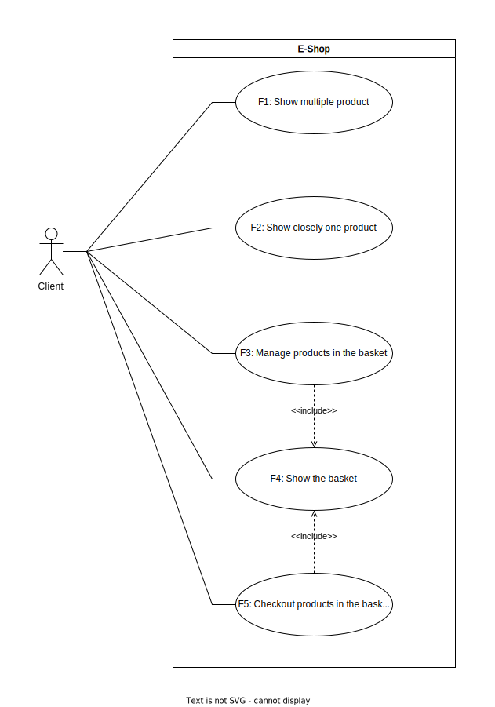
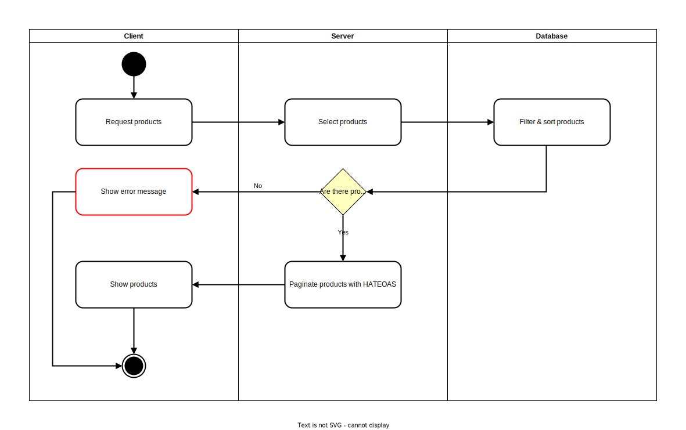
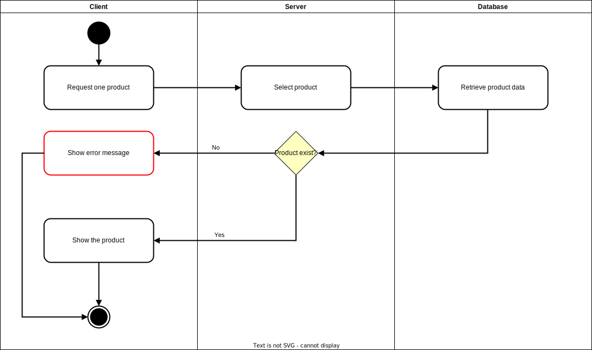
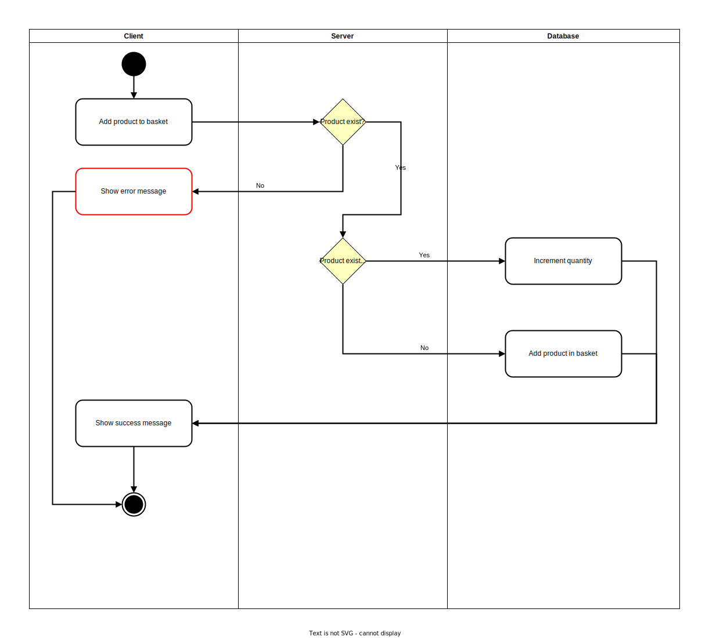
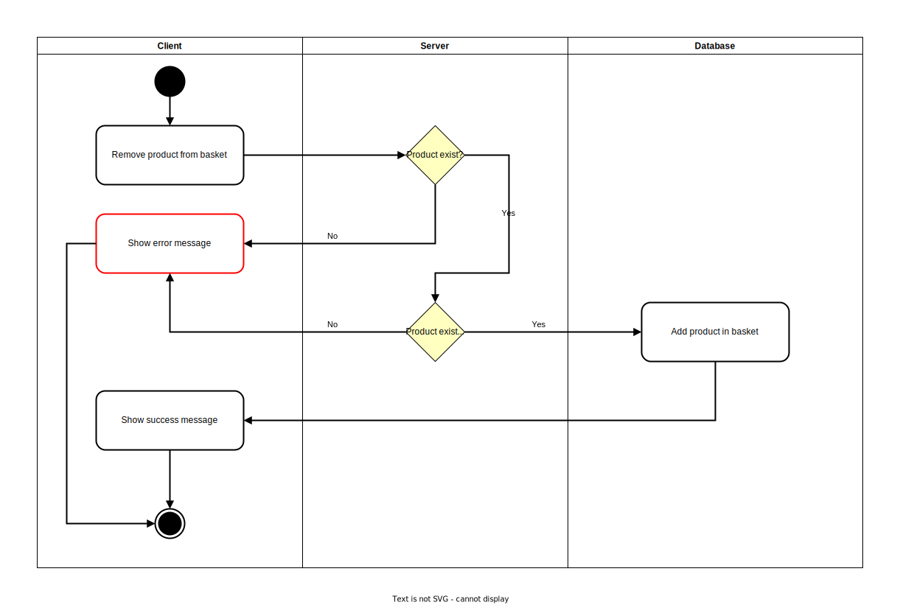
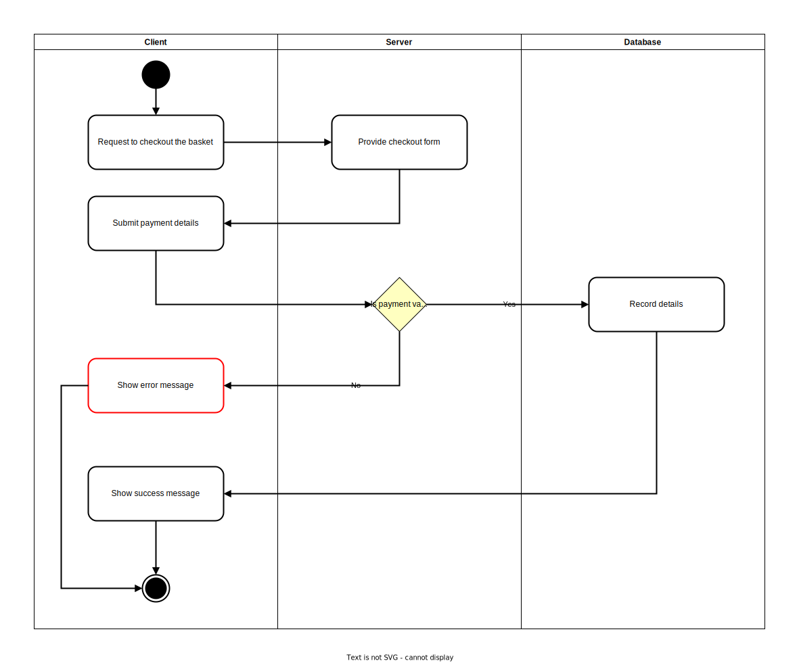
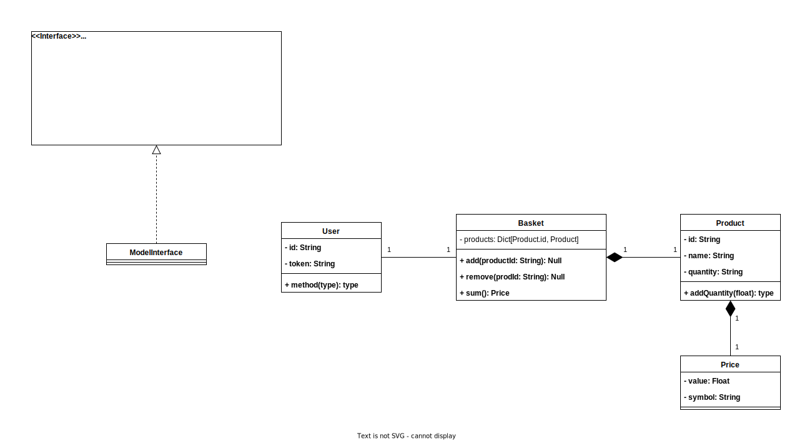

# E-Shop-1

## Plan

### Description

* This web application is a e-shop that use `Next.js` and `Nest.js` in its front end and back end respectively.

### Features

| ID  | Description                              |
| --- | ---------------------------------------- |
| F1  | Show multiple product                    |
| F2  | Show closely one product                 |
| F3  | Add and remove a product from the basket |
| F4  | Show the basket                          |
| F5  | Checkout products in the basket          |

### Versions

| Version | Feature to implement |
| :-----: | :------------------: |
|  v1.0   |        F1->F5        |

### Timeline

### Technology Stack

| Back-end              | Front-end    |
| --------------------- | ------------ |
| Nest.js               | Next.js      |
| TypeScript            | Tailwind CSS |
| TypeORM               |              |
| PostgreSQL            |              |
| Docker/Docker-Compose |              |

## Analyze and Design

### Software Architecture

#### Network components

[](resources/network-components.drawio.svg)

#### UML diagrams

##### Use case diagrams

[](resources/use-case.drawio.svg)

##### Activity diagrams

* Feature F1:
[](resources/activity-f1.drawio.svg)
* Feature F2:
[](resources/activity-f2.drawio.svg)
* Feature F3-Add:
[](resources/activity-f3-add.drawio.svg)
* Feature F3-Remove:
[](resources/activity-f3-remove.drawio.svg)
* Feature F5:
[](resources/activity-f5.drawio.svg)

##### Classes diagrams

[](resources/class-diagram.drawio.svg)

### Database

[](resources/erd-database.drawio.svg)

### API structure

#### API: Overall info

* Paradigm: **REST API**
* Data structures and types: `json`
* Authentication:
  * Token: users are authenticated with a unique token
* Authorization:
  * Each user has access to his own data only

#### API: Reference

##### `basket`

* `basket`:
  * Description: Basket where users put their [`product`](#product)
  * type: `object`
  * properties:
  * [`products`](#products)
  * `subtotal`:
    * Description: The total price of the basket
    * type: `float`
    * required: `True`

##### `card`

* `card`:
  * Description: Payment card details
  * type: `object`
  * Properties:
    * `firstname`:
      * Description: Card's firstname
      * type: `string`
      * required: `True`
    * `lastname`:
      * Description: Card's lastname
      * type: `string`
      * required: `True`
    * `number`:
      * Description: Card's number
      * type: `int`
      * required: `True`

##### `criteria`

* `criteria`:
  * Description: Value on which to base the sorting [`sort`](#sort)
  * type: `enum`
  * value: **See the usage**

##### `limit`

* `limit`:
  * Description: The maximum number of requested resources returned
  * type: `int`

##### `picture`

* `picture`:
  * Description: Link (URL or path) to access picture
  * type: `string`

##### `product`

* `product`:
  * Description: A product
  * type: `object`
  * properties:
    * `id`:
      * Description: Product's identifier
      * type: `string`
    * `name`:
      * Description: Product's name
      * type: `string`
    * `pictures`:
      * Description: List of product [`picture`](#picture)
      * type: `list`
    * `quantity`:
      * Description: Quantity of the product
      * type: `int`
      * required: `False`
    * `price`:
      * Description: Quantity of the product
      * type: `float`
      * required: `True`

##### `products`

* `products`:
  * Description: List of [`product`](#product)
  * type: `list`

##### `page`

* `page`:
  * Description: Indicate the position of the page to get in pagination
  * Constraint:
    * The position of the first page is `0`
    * If not given then the default page position if `0`
    * If the page position is outside the number of page available then the last page is returned
  * type: `int`

##### `sort`

* `sort`:
  * Description: To order the response
  * type: `enum`
  * value: `asc`|`desc`

##### `user`

* `user`:
  * Description: An user
  * type: `object`
  * properties:
    * `id`:
      * Description: user's identifier
      * type: `string`
      * required: `False`
    * `email`:
      * Description: user's email
      * type: `string`
    * `password`:
      * Description: user's password
      * type: `string`

#### API: Endpoints

##### User Sign Up

* **Description**: Register a new user
* **Request**:
  * Path: `/api/v1/user`
  * Method: `POST`
  * Parameter:
    * [`email`](#user):
      * required: `True`
    * [`password`](#user):
      * required: `True`
  * Example:

    ```HTTP
    POST /api/v1/user
    ```

* **Response**:
  * Body: **None**
  * Example:

    ```json
    // Empty body
    ```

##### User Log in

* **Description**: Log in a new user
* **Request**:
  * Path: `/api/v1/user/login`
  * Method: `POST`
  * Parameter:
    * [`email`](#user):
      * required: `True`
    * [`password`](#user):
      * required: `True`
  * Example:

    ```HTTP
    POST /api/v1/user/login
    ```

* **Response**:
  * Body: **None**
  * Example:

    ```json
    // Empty body
    ```

##### Get Multiple Products

* **Description**: To request list of product
* **Request**:
  * Path: `/api/v1/products`
  * Method: `GET`
  * Parameter:
    * [`sort`](#sort):
      * required: `False`
    * [`criteria`](#criteria):
      * value: `price`|`name`
      * required: `True` only if [`sort`](#sort) is provided else `False`
    * [`limit`](#limit):
      * Constraint:
        * If not provided, a default is used
      * required: `False`
    * [`page`](#page):
      * required: `False`
  * Example:

    ```HTTP
    GET /api/v1/products?sort=desc&criteria=price&limit=15&page=3
    ```

* **Response**:
  * Body:
    * [`products`](#products)
    * `pagination`:
      * Description: List of link to get other page of product
      * Constraint:
        * Page are grouped following the [`limit`](#limit) parameter and the number of product available
      * type: `list` of `string`
  * Example:

    ```json
    {
      "products": [
        {
          "id": "abcd123",
          "name": "amazing product a",
          "pictures": [
            "/api/v1/picture/1",
            "/api/v1/picture/2"
          ]
        },
        {
          "id": "efgh456",
          "name": "amazing product b",
          "pictures": [
            "/api/v1/picture/3",
            "/api/v1/picture/4"
          ]
        }
      ],
      "pagination": [
        // The current page is 3 so there's no link for it
        "/api/v1/products?sort=desc&criteria=price&limit=15&page=0",
        "/api/v1/products?sort=desc&criteria=price&limit=15&page=1",
        "/api/v1/products?sort=desc&criteria=price&limit=15&page=2",
        "/api/v1/products?sort=desc&criteria=price&limit=15&page=4",
        "/api/v1/products?sort=desc&criteria=price&limit=15&page=5"
      ]
    }
    ```

##### Get One Product

* **Description**: To request one product
* **Request**:
  * Path: `/api/v1/product/:product_id`
    * `:product_id`: The identifier of a product
  * Method: `GET`
  * Parameter: **None**
  * Example:

    ```HTTP
    GET /api/v1/product/abcd123
    ```

* **Response**:
  * Body:
    * [`products`](#products)
  * Example:

    ```json
    {
      "id": "abcd123",
      "name": "amazing product a",
      "pictures": [
        "/api/v1/picture/1",
        "/api/v1/picture/2"
      ]
    }
    ```

##### Get Basket

* **Description**: To get an user's basket
* **Request**:
  * Path: `/api/v1/basket`
  * Method: `GET`
  * Parameter: **None**
  * Example:

    ```HTTP
    GET /api/v1/basket
    ```

* **Response**:
  * Body:
    * [`basket`](#basket)
  * Example:

    ```json
    [
      {
        "id": "ijkl789",
        "name": "amazing product c",
        "pictures": [
          "/api/v1/picture/5",
          "/api/v1/picture/6"
        ],
        "quantity": 3
      },
      {
        "id": "abcd123",
        "name": "amazing product a",
        "pictures": [
          "/api/v1/picture/1",
          "/api/v1/picture/2"
        ],
        "quantity": 2
      },
      {
        "id": "efgh456",
        "name": "amazing product b",
        "pictures": [
          "/api/v1/picture/3",
          "/api/v1/picture/4"
        ],
        "quantity": 1
      }
    ]
    ```

##### Add Products To The Basket

* **Description**: To add products in the basket
* **Request**:
  * Path: `/api/v1/basket`
  * Method: `POST`
  * Body:
    * `id`:
      * Description: A [`product`](#product)'s identifier
      * required: `True`
    * `quantity`:
      * Description: Number of [`product`](#product) to add
      * required: `True`

  * Example:

    ```HTTP
    POST /api/v1/basket
    ```

    ```json
    [
      {
        "id": "ijkl789",
        "quantity": 2
      },
      {
        "id": "efgh456",
        "quantity": 1
      },
      {
        "id": "abcd123",
        "quantity": 3
      }
    ]
    ```

* **Response**:
  * Body: **None**
  * Example:

    ```json
    // Empty body
    ```

##### Change Products In The Basket

* **Description**: To update the products in the basket
* **Request**:
  * Path: `/api/v1/basket`
  * Method: `PUT`
  * Body:
    * `id`:
      * Description: A [`product`](#product)'s identifier
      * required: `True`
    * `quantity`:
      * Description: Quantity of a [`product`](#product) to keep in the basket
      * Constraint:
        * The new quantity can't be `0`
      * required: `True`

  * Example:

    ```HTTP
    PUT /api/v1/basket
    ```

    ```json
    [
      {
        "id": "ijkl789",
        "quantity": 2
      },
      {
        "id": "efgh456",
        "quantity": 1
      },
      {
        "id": "abcd123",
        "quantity": 3
      }
    ]
    ```

* **Response**:
  * Body: **None**
  * Example:

    ```json
    // Empty body
    ```

##### Remove Products From The Basket

* **Description**: To remove products from the basket
* **Request**:
  * Path: `/api/v1/basket`
  * Method: `DELETE`
  * Body:
    * Description: List of [`product`](#product)'s identifier
    * type: `list`
  * Example:

    ```HTTP
    DELETE /api/v1/basket
    ```

    ```json
    [
      "ijkl789",
      "efgh456",
      "abcd123"
    ]
    ```

* **Response**:
  * Body: **None**
  * Example:

    ```json
    // Empty body
    ```

##### Checkout The Basket

* **Description**: To checkout the basket
* **Request**:
  * Path: `/api/v1/checkout`
  * Method: `POST`
  * Parameter:
    * [`card`](#card):
  * Example:

    ```HTTP
    POST /api/v1/checkout
    ```

    ```json
    {
      "card": {
        "firstname": "john",
        "lastname": "doe",
        "number": "0123456789101112"
      }
    }
    ```

* **Response**:
  * Body: **None**
  * Example:

    ```json
    // Empty body
    ```

#### API: Error Handling

##### Error: Structure

* Follow [RFC7807](https://datatracker.ietf.org/doc/html/rfc7807) rules
* Parameters (`RFC7807`):
  * `type`: A URI reference that identifies the problem type.
  * `title`: A short, human-readable summary of the problem type.
  * `status`: The HTTP status code
  * `detail`: A human-readable explanation specific to this occurrence of the problem.
  * `instance`: A URI reference that identifies the specific occurrence of the problem.
    * In other words, the URI used to perform the request
* Parameters (mine):
  * `code`: The code system of the error.
  * `error`: Where API can place all the information related to the error.
* Example:

  ```JSON
  {
      "type": "https://example.com/doc/unknown-product",
      "title": "Product not found",
      "status": 400,
      "detail": "Product with id '123abc' do not exist",
      "instance": "/api/v1/product/123abc",
      "code": 2300,
      "error": {}
    }
  ```

##### Error: Category

| Category            | HTTP Range | System Range | Description                                        |
| ------------------- | ---------- | ------------ | -------------------------------------------------- |
| System error        | 500        | 1000         | Error from the server side                         |
| Unavailable service | 500        | 1100         | Can't perform request due to a unavailable service |
| Unknown service     | 500        | 1200         | An undocumented error                              |
| Client error        | 400        | 2000         | Error from the server side                         |
| Unauthorized access | 400        | 2100         | Unauthorized access to resource             |
| Malformed request   | 400        | 2200         | Request don't respect data structure and/or type   |
| Invalid request     | 400        | 2300         | Request's content is not valid                     |
| Conflict state      | 400        | 2400         | The current state don't allow the operation        |

##### Error: Documentation

| System Error Code | HTTP Status Code | Machine-Readable | Human-Readable |
| ----------------- | ---------------- | ---------------- | -------------- |
|                   |                  |                  |                |
