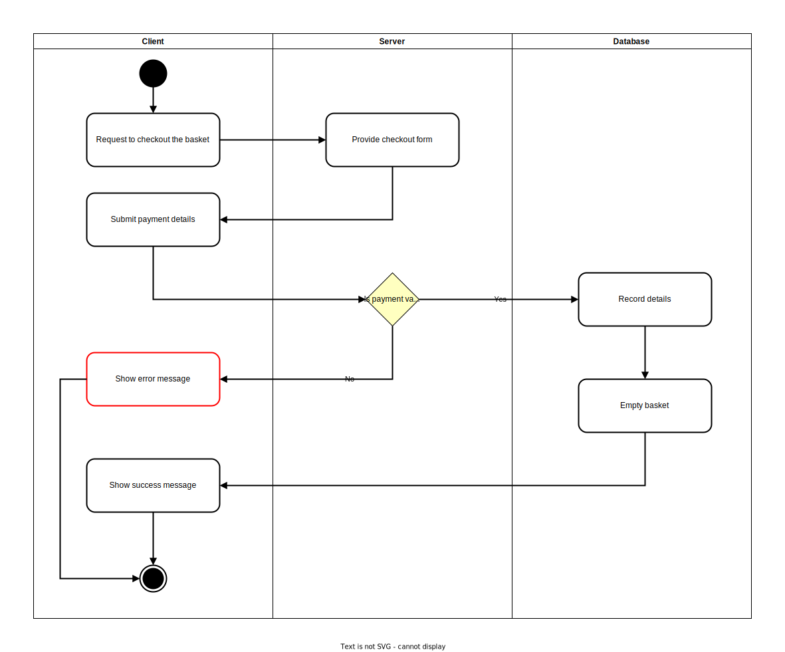
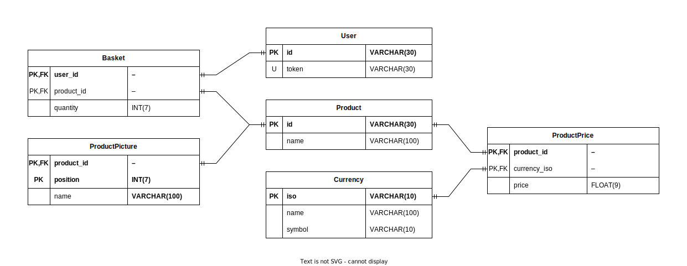

# E-Shop-1

## Plan

### Description

* This web application is a e-shop that use `Next.js` and `Nest.js` in its front end and back end respectively.

### Features

| ID  | Description                              |
| --- | ---------------------------------------- |
| F1  | Show multiple product                    |
| F2  | Show closely one product                 |
| F3  | Add and remove a product from the basket |
| F4  | Show the basket                          |
| F5  | Checkout products in the basket          |

### Versions

| Version | Feature to implement |
| :-----: | :------------------: |
|  v1.0   |        F1->F5        |

### Timeline

### Technology Stack

| Back-end              | Front-end    |
| --------------------- | ------------ |
| Nest.js               | Next.js      |
| TypeScript            | Tailwind CSS |
| PostgreSQL            |              |
| Docker/Docker-Compose |              |

## Analyze and Design

### Software Architecture

#### Network components

[](resources/network-components.drawio.svg)

#### UML diagrams

##### Use case diagrams

[](resources/use-case.drawio.svg)

##### Activity diagrams

* Feature F1:
[](resources/activity-f1.drawio.svg)

* Feature F2:
[](resources/activity-f2.drawio.svg)
* Feature F3-Add:
[](resources/activity-f3-add.drawio.svg)
* Feature F3-Remove:
[](resources/activity-f3-remove.drawio.svg)
* Feature F5:
[](resources/activity-f5.drawio.svg)

##### Classes diagrams

[](resources/class-diagram.drawio.svg)

### Database

[](resources/erd-database.drawio.svg)

### API structure

* Paradigm (RestFull, Websocket, etc...)
* Endpoints
* Authentication
* Authorization

#### API: Overall info

* Paradigm: **REST API**
* Data structures and types: `json`
* authentication: **None**
* authorization: **None**

#### API: Reference

##### Reference

##### Reference: `sort`

* `sort`:
  * Description: To order the response
  * type: `enum`
  * value: `asc`|`desc`
  * required: `False`

##### Reference: `criteria`

* `criteria`:
  * Description: Value on which to base the sorting [`sort`](#reference-sort)
  * type: `enum`
  * value: **See the usage**
  * required: `True` Only if [`sort`](#reference-sort) is provided else `False`

##### Reference: `limit`

* `limit`:
  * Description: The maximum number of requested resources returned
  * type: `int`
  * required: **See the usage**

##### Reference: `page`

* `page`:
  * Description: Indicate the position of the page to get in pagination
  * Constraint:
    * The position of the first page is `0`
    * If not given then the default page position if `0`
    * If the page position is outside the number of page available then the last page is returned
  * type: `int`
  * required: `False`

##### Reference: `products`

* `products`: List of [`product`](#reference-product)
  * type: `list`

##### Reference: `product`

* `product`: a product
  * type: `object`
  * properties:
    * `id`:
      * Description: Product's identifier
      * type: `string`
    * `name`:
      * Description: Product's name
      * type: `string`
    * `pictures`: List of product [`picture`](#reference-picture)
      * type: `list`

##### Reference: `picture`

* `picture`: Link (URL or path) to access picture
  * type: `string`

#### API: Endpoints

##### Get Products

* **Description**: To request list of product
* **Request**:
  * Path: `/api/products`
  * Method: `GET`
  * Parameter:
    * [`sort`](#reference-sort):
    * [`criteria`](#reference-criteria):
      * value: `price`|`name`
    * [`limit`](#reference-limit):
      * Constraint:
        * If not provided, a default is used
      * required: `False`
    * [`page`](#reference-page):

  ```HTTP
  GET /api/products?sort=desc&criteria=price&limit=15&page=3
  ```

* **Response**:
  * [`products`](#reference-products)
  * `pagination`:
    * Description: List of link to get other page of product
    * Constraint:
      * Page are grouped following the [`limit`](#reference-limit) parameter and the number of product available
    * type: `list` of `string`

  ```json
  {
    "products": [
      {
        "id": "abcd123",
        "name": "amazing product a",
        "pictures": [
          "/api/picture/1",
          "/api/picture/2"
        ]
      },
      {
        "id": "efgh456",
        "name": "amazing product b",
        "pictures": [
          "/api/picture/3",
          "/api/picture/4"
        ]
      }
    ],
    "pagination": [
      // The current page is 3 so there's no link for it
      "/api/products?sort=desc&criteria=price&limit=15&page=0",
      "/api/products?sort=desc&criteria=price&limit=15&page=1",
      "/api/products?sort=desc&criteria=price&limit=15&page=2",
      "/api/products?sort=desc&criteria=price&limit=15&page=4",
      "/api/products?sort=desc&criteria=price&limit=15&page=5"
    ]
  }
  ```

#### API: Design API error handling

### User interface

#### Pages

1. Home/landing page
2. Grid page
3. Product page
4. Basket page

#### Mock-up

UI Mock-up
